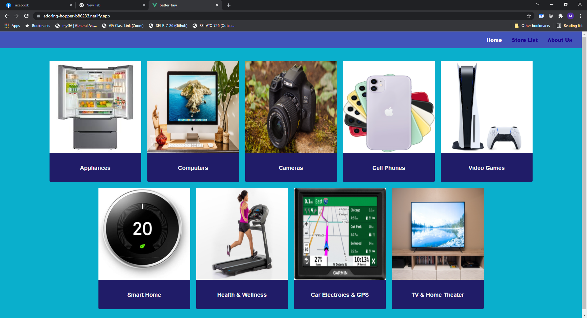
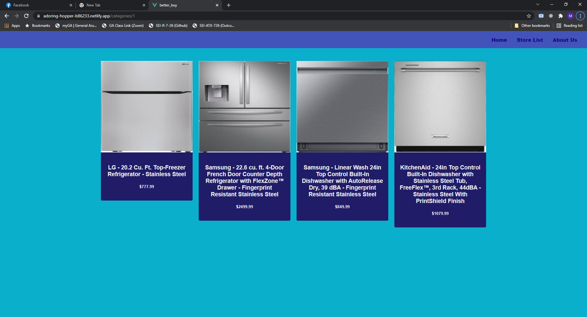
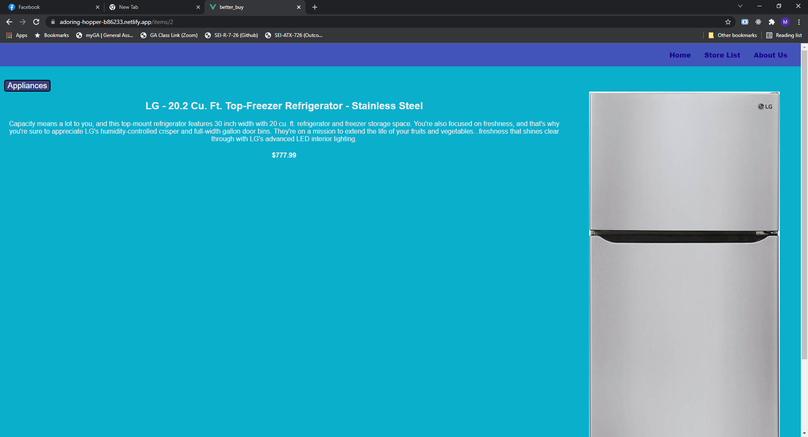

# BetterBuy

## Date: 10/18/2021

### By: Max Arenstein

[Facebook](https://www.facebook.com/max.arenstein/) | [Twitter](https://twitter.com/MisterMindX) | [Github](https://github.com/MistermindX) | [LinkedIn](https://www.linkedin.com/in/max-arenstein/)

---

### **_Description_**

#### Best Buy clone to test new technologies and APIs.

---

### **_Technologies Used_**

- Vue
- Python/Flask

---

### **_Getting Started_**

##### View items for sale. When you are ready to order just sign in or sign up and create your order.

##### A Trello board was used to keep track of development progress and can be viewed [here](https://trello.com/b/yI6rz9xg/better-buy).

##### The project itself was deployed and can be viewed [here](https://adoring-hopper-b86233.netlify.app/).

---

### **_Screenshots_**

##### Homepage

##### Category Search Page

##### Item Details Page

---

### **_Future Updates_**

- [ ] Adjust Image sizes so it looks better
- [ ] Order Functionality
- [ ] User Functionality with Auth
- [ ] Map locations with Mapbox
- [ ] Install Auth0

---

### **_Credits_**

---
